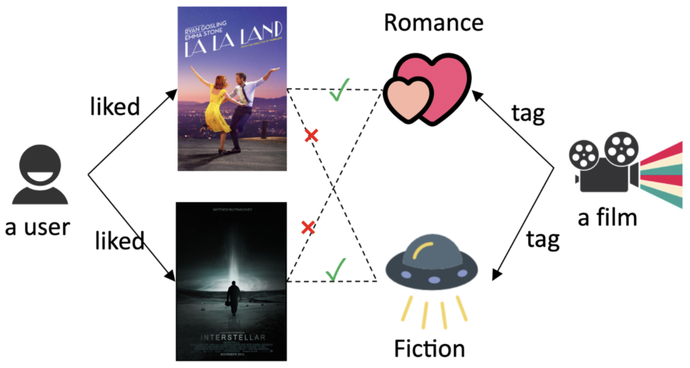

Tensorflow implementation of the paper ``An End-to-End Neighborhood-based Interaction Model for Knowledge-enhanced Recommendation``.
This paper is accepted by, and and wins the ``best paper award`` of the 1st International Workshop on Deep Learning Practice for High-Dimensional Sparse Data, KDD'19 (DLP-KDD'19), Anchorage, AK, USA.

See our [paper](https://arxiv.org/abs/1908.04032), [poster](./material/kni_poster.pdf), [ppt](./material/kni_presentation.pdf).
If you have any questions, please contact ``kevinqu16@gmail.com`` directly or open a github issue.
I will reply ASAP.

### What's KNI model?

In recommender systems, graph-based models build interaction graphs from historical feedbacks (e.g., user ratings) and side information (e.g., film tags, artists), 
and utilize the rich structural information to boost recommendation performance.

Due to the complex structures and large scales (of the graphs), it is hard to make predictions directly, 
thus the existing approaches turn to encoding the meticulous structures into user/item embeddings.
Since the rich structural information is compressed in only 2 nodes and 1 edge, 
we concern the valuable local structures are not fully utilized in previous literature,
which we call the ``early summarization issue``.

After reviewing the existing methods, we derive a general architecture of these methods, 
and propose ``Neighborhood Interaction`` (NI) model to make predictions from the graph structures directly.
NI is further integrated with graph neural networks (GNNs) and knowledge graphs (KGs), namely Knowledge-enhanced NI (KNI).

KNI model is not only theoretically more expressive, but also achieves great improvements (1.1% ~ 8.4%) over SOTA models.
We also provide statistical analysis and case study to explain the early summarization issue and compare different models' behaviors.

For more details, please refer to our [paper](https://arxiv.org/abs/1908.04032), [poster](./material/kni_poster.pdf), [ppt](./material/kni_presentation.pdf).

### Running step-by-step

Requirements:
- python3
- numpy
- ccipy
- sklearn
- tqdm
- tensorflow-gpu

Step 1. Download the data from [https://pan.baidu.com/s/1usnQtW-YodlPUQ1TNrrafw#list/path=%2Fdataset%2Fkg4rs](https://pan.baidu.com/s/1usnQtW-YodlPUQ1TNrrafw#list/path=%2Fdataset%2Fkg4rs) or [https://drive.google.com/drive/folders/1thXezQbmuS6Q8-AXmrhB0tLM3mybJxVR?usp=sharing](https://drive.google.com/drive/folders/1thXezQbmuS6Q8-AXmrhB0tLM3mybJxVR?usp=sharing) and uncompress ``pickled_data.tar.gz`` under ``./data/``, like:

    ./data
        ab.pkl
        bc.pkl
        ml-1m.pkl
        ml-20m.pkl
    ./process
        *.py
    *.py

The data is processed and pickled by python3, up to 4-hop. 
According to your experiment settings, you can remove unreachable nodes and edges of the datasets.

Step 2. Run ``train.py`` with default parameters for ``bc`` dataset.
You have model options of ni (= ni:1) and ni:2, which have different attention network structures.
Knowledge graph is the default setting, and you can turn off it by setting --kg=False.

    cd /path/to/code/
    python3 train.py --dataset=bc --model=ni

After a while, you will see logs like the following (the train/dev scores are disabled for speed concern):

    ...
    Epoch: 0057 test: auc=0.771917 ll=0.575557 acc=0.706051
    Epoch: 0058 test: auc=0.772221 ll=0.575257 acc=0.705843
    Epoch: 0059 test: auc=0.772380 ll=0.575088 acc=0.703685
    Epoch: 0060 test: auc=0.771758 ll=0.575617 acc=0.704059
    Epoch: 0061 test: auc=0.771504 ll=0.575559 acc=0.704017
    ...

The default script will run the same experiment for 5 times with different random seeds. 
You may find the experiments early stop at 0.772 AUC, 0.706 ACC (+/- 0.002).

Now you achieve the new ``state-of-the-art`` :-) (by the time of submission, the best performed model is RippleNet, 0.729 AUC, 0.663 ACC).

For the other datasets:

    python3 train.py --dataset=ab --model=ni:2 --max_degree=128 --hop_n_sample=1,8 --learning_rate=1e-3 --l2_reg=1e-7 --n_eval=40 --temp=100
    python3 train.py --dataset=ml-1m --model=ni:2 --max_degree=512 --hop_n_sample=1,32 --learning_rate=1e-3 --l2_reg=1e-7 --n_eval=40 --temp=1
    python3 train.py --dataset=ml-20m --model=ni:2 --max_degree=128 --hop_n_sample=1,32 --learning_rate=1e-3 --l2_reg=1e-8 --n_eval=10 --temp=1

### Stay Connected!

If you see this paper/data/code helpful or related, please cite our paper with the following BibTeX entry

@inproceedings{qu2019end,
  title={An end-to-end neighborhood-based interaction model for knowledge-enhanced recommendation},
  author={Qu, Yanru and Bai, Ting and Zhang, Weinan and Nie, Jianyun and Tang, Jian},
  booktitle={Proceedings of the 1st International Workshop on Deep Learning Practice for High-Dimensional Sparse Data},
  pages={1--9},
  year={2019}
}
